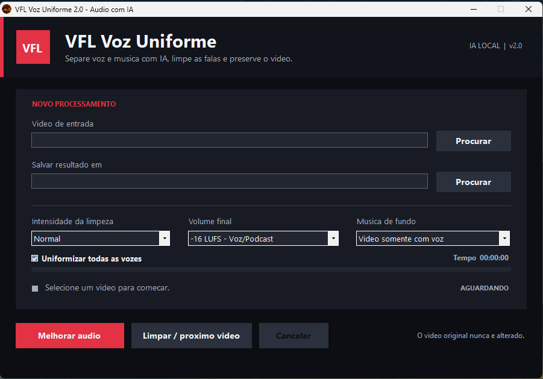

# VFL Voz Uniforme Portátil 2.1 GPU

  

Aplicativo portátil para Windows que uniformiza o volume das falas, reduz ruídos e pode separar voz e música com inteligência artificial. A versão 2.1 usa automaticamente placas NVIDIA compatíveis para acelerar a etapa de IA e preserva aproximadamente 20% dos recursos para o Windows e outros aplicativos. Todo o processamento acontece no próprio computador: nenhum vídeo é enviado para a internet.

## Interface do programa

  

## Apoie o projeto

Se o VFL Voz Uniforme foi útil para você e quiser ajudar no desenvolvimento de novas versões, apoie o projeto pelo Apoia.se:

  

**Apoia.se:** https://apoia.se/vfl

## Baixar a versão pronta

Baixe o arquivo **`VFL_Voz_Uniforme_Portatil_v2.1_GPU.zip`** na página de [Releases](../../releases/latest).

> Não execute o programa de dentro do ZIP. Extraia todo o conteúdo primeiro e mantenha a pasta `third_party` ao lado do executável.

## Principais recursos

- uniformiza falas baixas e altas;
- reduz ruído contínuo e limpa frequências desnecessárias;
- comprime a dinâmica, normaliza o volume em LUFS e limita picos;
- separa voz e música com o modelo MDX;
- permite manter a música em 15% ou removê-la;
- copia a imagem do vídeo original sem recompressão;
- mostra tempo decorrido, estimativa restante e tempo total;
- detecta a GPU NVIDIA automaticamente e usa CUDA/ONNX na separação por IA;
- trabalha em perfil equilibrado, reservando cerca de 20% da CPU e da memória da GPU;
- continua pela CPU automaticamente quando a aceleração NVIDIA não estiver disponível;
- funciona de forma local e offline.

## Modos disponíveis

- **Vídeo somente com voz:** tratamento rápido, sem separação por IA.
- **Manter música (suave):** preserva a faixa completa com tratamento mais delicado.
- **Deixar música baixa — IA:** separa as faixas, trata a voz e remonta com a música em 15%.
- **Remover música — IA:** separa as faixas e mantém somente a voz tratada.

## Como usar

1. Baixe o ZIP da versão mais recente.
2. Clique com o botão direito no arquivo, abra **Propriedades** e marque **Desbloquear**, caso essa opção apareça.
3. Extraia todo o conteúdo para uma pasta de caminho curto, como `C:\VFL21`.
4. Execute `VFLVozUniforme.exe`.
5. Escolha o vídeo, a intensidade, o volume-alvo e o modo de música.
6. Clique em **Melhorar áudio**.

O arquivo final recebe, por padrão, o sufixo `_audio_melhorado.mp4`.

## Requisitos

- Windows 10 ou Windows 11 de 64 bits;
- aproximadamente 3,2 GB livres após a extração;
- não requer instalação de Python, FFmpeg ou do modelo de IA;
- GPU NVIDIA com driver atualizado é recomendada; RTX 3060, RTX 4090 e modelos compatíveis são detectados automaticamente;
- sem uma GPU NVIDIA compatível, a separação continua funcionando pelo processador, porém mais lentamente.

## Desempenho observado

Em um vídeo de aproximadamente 4 horas, usando Ryzen 9 7950X e RTX 4090, o mesmo processamento caiu de **1h40min12s** na versão por CPU para **19min57s** na versão 2.1 GPU: cerca de **5 vezes mais rápido**, com redução aproximada de **80%** no tempo total. O resultado varia conforme o vídeo, a placa de vídeo e o restante do computador.

## Observações

- o vídeo original nunca é alterado;
- no momento, somente a primeira faixa de áudio é processada;
- pessoas falando simultaneamente não são separadas individualmente;
- a separação por IA pode deixar pequenos resíduos em trechos onde voz e instrumentos têm frequências muito parecidas;
- o executável não possui assinatura digital, então o Windows pode exibir um aviso de proteção.

## Código-fonte

- `src/VozUniforme.cs`: interface WinForms e pipeline principal;
- `src/separate.py`: integração com o separador MDX;
- `assets/`: logotipo e ícone do aplicativo.

O pacote portátil inclui componentes de terceiros que não são mantidos no histórico deste repositório. Consulte [THIRD_PARTY_NOTICES.md](THIRD_PARTY_NOTICES.md) para os créditos e projetos utilizados.

## Licença de uso

O VFL Voz Uniforme é disponibilizado para **uso gratuito e não comercial**. É permitido usar, estudar, modificar e compartilhar gratuitamente com os devidos créditos. Não é permitido vender, cobrar pelo acesso, incorporar em produto ou serviço pago, nem remover a autoria. Leia os termos completos em [LICENSE.md](LICENSE.md).

## Versão

**VFL Voz Uniforme 2.1.0 GPU** — aceleração automática com uma margem de recursos para o computador continuar utilizável.
